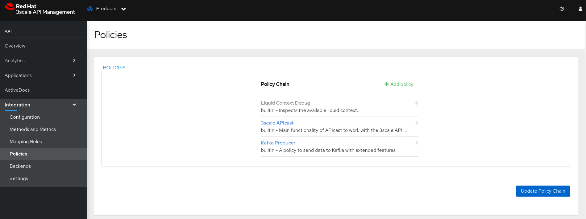

# 3Scale - Policy - Kafka Producer

## Prerequisites

  - A Red Hat OpenShift Container Platform Cluster [1]
  - Red Hat 3Scale API Management [2]
    - Deployed in Namespace: `3scale`.
  - Red Hat AMQ Streams [3]
    - Deployed in Namespace: `kafka`.
    - Kafka Cluster
      - Name: `kafka-cluster`
    - Kafka Bridge
      - URL: `http://kafka-bridge-bridge-service.kafka.svc.cluster.local:8080`
    - Kafka Topic
        - Name: `3scale-policy-kafka-producer`
  
  ***Some files with the extension `.yaml` are available in the ./resources directory in order to facilitate the implementation of the components used for the operation of this Policy***

    - Remember to change files with the `.yaml` extension to reflect the values of the environment in which this Policy is being deployed.

## Description

  Policy Kafka Producer enables Red Hat 3Scale API Management to provide an option for sending Request and Response information that passes through the APICast component. This Policy is designed to enrich your data stream and send such information to Red Hat AMQ Streams as valuable traffic insights related to APICast and API Management.

## Implementing the Policy

  To implement the Policy we need to perform some steps.

  > 01 - Create the ConfigMap resource in the namespace that is deploying Red Hat 3Scale API Management.

  ```bash
    oc delete secret policy-kafka-producer -n 3scale
    
    oc create secret generic policy-kafka-producer \
      --from-file=apicast-policy.json=./apicast-policy.json \
      --from-file=init.lua=./init.lua \
      --from-file=kafka-producer.lua=./kafka-producer.lua \
      -n 3scale
  ```
  
  *Whenever there is a need to change the ConfigMap, it will be necessary to rollout the PODs `apicast-staging-*` e `apicast-production-*`*

  > 02 - In the resource, `kind: APIManager`, add the following content:
  ```bash
apicast:
    productionSpec:
      customPolicies:
        - name: kafka-producer
          secretRef:
            name: policy-kafka-producer
          version: builtin
    stagingSpec:
      customPolicies:
        - name: kafka-producer
          secretRef:
            name: policy-kafka-producer
          version: builtin
  ```
  > 03 (Optional) - Still for the resource, `kind: APIManager`, your can enable logging at DEBUG, just add the following content:
  ```bash
spec:
  apicast: 
    stagingSpec:
      logLevel: debug
    productionSpec:
      logLevel: debug
  ```

## Validating the operation of the Policy

  Before we evaluate the operation of the Policy, we need to verify that the topic in the Kafka Topic resource is fully functioning using the Kafka Bridge resource.

  > 01 - Register a consumer for the topic in question, simply access the Kafka POD via terminal and execute the command:
  ```bash
  ./bin/kafka-console-consumer.sh --bootstrap-server localhost:9092 --topic 3scale-policy-kafka-producer
  ```

  > 02 - Now with the consumer listening to the events for the topic, we can send a test message, the expected result is to see the message in the consumer's terminal log.

  ***For our example, the Kafka Bridge URL is `http://kafka-bridge-bridge-service.kafka.svc.cluster.local:8080`, therefore, we inform the address in the CURL command below:***

  ```bash
  curl -X POST \
    -H "Content-Type: application/vnd.kafka.json.v2+json" \
    -H "Accept: application/vnd.kafka.v2+json" \
    --data '{"records": [{"key": "recordKey","value": "recordValue"}]}' \
    "http://kafka-bridge-bridge-service.kafka.svc.cluster.local:8080/topics/3scale-policy-kafka-producer"
  ```

  > 03 - Now that we have validated that the topic works in Kafka, we need to access the Red Hat 3Scale API Management Portal and associate the Policy Kafka Producer with a Product so that we can validate its operation.

  Access the page: Home > Products > Product ID > Integration > Policies
  
  Clique em `+ Add policy`

  

  Search for Policy Kafka Producer and click on it

  

  You will see that it has been loaded into the Policy Chain list

  

  You now need to configure 02 properties in the Policy, they are `Kafka Bridge` and `Kafka Topic`

  

  Once done, click on `Update Policy`, you will be redirected to the `Policy Chain` Page

  Now change the order of the Policy, making the Kafka Producer Policy run before the Red Hat 3Scale API Management default Policy

  

  Remember to click on `Update Policy Chain`, otherwise your changes will not be saved.

  Now you need to carry out the promotion to the `Staging` environment and later, after everything validates in `Staging`, promote to `Production`

  To do this, access the menu: Home > Products > Product ID > Integration > Configuration

  

  Okay, the `Exclamation` point should be hidden after the promotion to `Staging`

  Now when making a call to your API within 3Scale, you will be able to see a JSON object with the following content:
  ```bash
    data = {
        user_information = {
            app_id = app_id,
            user_key = user_key
        },
        request = {
            id = ngx.var.request_id,
            method = ngx.req.get_method(),
            uri = ngx.var.uri,
            query = query_param,
            headers = request_headers,
            request_headers_size = request_headers_size,
            request_body_size = request_body_size
        },
        response = {
            status = ngx.status,
            headers = response_headers,
            response_headers_size = response_headers_size,
            response_body_size = response_body_size
        },
        service_id = service_id,
        transaction_size = total_size
    }
  ```

## References:

[1] - https://access.redhat.com/products/openshift/

[2] - https://www.redhat.com/en/technologies/jboss-middleware/3scale

[3] - https://access.redhat.com/products/red-hat-amq-streams/