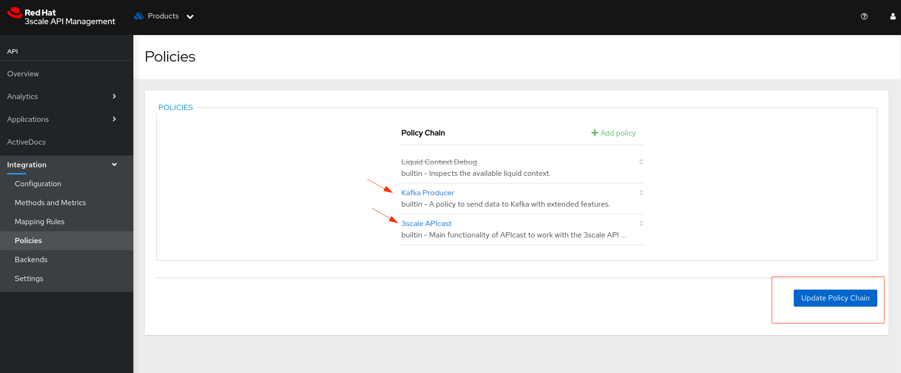

# 3Scale - Policy - Kafka Producer

## Pré-requisitos

  - Um Cluster do Red Hat OpenShift Container Platform [1]
  - Red Hat 3Scale API Management [2]
    - Implantado no Namespace: `3scale`.
  - Red Hat AMQ Streams [3]
    - Implantado no Namespace: `kafka`.
    - Kafka Cluster
      - Nome: `kafka-cluster`
    - Kafka Bridge
      - URL: `http://kafka-bridge-bridge-service.kafka.svc.cluster.local:8080`
    - Kafka Tópic
        - Nome: `3scale-policy-kafka-producer`
  
  ***Disponibilizei no diretório ./resources alguns arquivos com extensão `.yam` com intuito de facilitar a implantação dos componentes utilizados para o funcionamento desta Policy***

    - Lembre-se de alterar os arquivos com extensão `.yaml` para refletir os valores do ambiente no qual está sendo implantado esta Policy.

## Descrição

  A Policy Kafka Producer, possibilita ao Red Hat 3Scale API Management fornecer uma opção para o envio das informações de Request e Response que trafegam no componente APICast. Essa Policy foi projetada para enriquecer seu fluxo de dados e enviar tais informações ao Red Hat AMQ Streams como insights valiosos do tráfego relacionados ao APICast e API Management.

## Implantando a Policy

  Para realizar a implantação da Policy precisamos realizar alguns passos.

  > 01 - Criar o recurso ConfigMap no namespace que está a implantação do Red Hat 3Scale API Management.

  ```bash
    oc delete secret 3scale-policy-kafka-producer -n 3scale
    
    oc create secret generic 3scale-policy-kafka-producer \
      --from-file=apicast-policy.json=./apicast-policy.json \
      --from-file=init.lua=./init.lua \
      --from-file=kafka-producer.lua=./kafka-producer.lua \
      -n 3scale
  ```
  
  *Sempre que houver a necessidade de alteração do ConfigMap será necessário realizar o rollout dos PODs `apicast-staging-*` e `apicast-production-*`*

  > 02 - No recurso, `kind: APIManager`, adicionar o seguinte conteúdo:
  ```bash
apicast:
    productionSpec:
      customPolicies:
        - name: kafka-producer
          secretRef:
            name: 3scale-policy-kafka-producer
          version: builtin
    stagingSpec:
      customPolicies:
        - name: kafka-producer
          secretRef:
            name: 3scale-policy-kafka-producer
          version: builtin
  ```
  > 03 (Opcional) - Ainda para o recurso, `kind: APIManager`, você pode habilitar o log a nível DEBUG, basta adicionar o seguinte conteúdo:
  ```bash
spec:
  apicast: 
    stagingSpec:
      logLevel: debug
    productionSpec:
      logLevel: debug
  ```

## Validando o funcionamento da Policy

  Antes de testarmos o funcionamento da Policy, precisamos testar os se o tópico do recurso Kafka Topic estão em pleno funcionamento usando o recurso Kafka Bridge.

  > 01 - Registre um consumidor para o tópico em questão, basta acessar o POD do Kafka via terminal e executar o comando:
  ```bash
  ./bin/kafka-console-consumer.sh --bootstrap-server localhost:9092 --topic 3scale-policy-kafka-producer
  ```

  > 02 - Agora com o consumer ouvindo os eventos para o tópico, podemos enviar uma mensagem de teste, o resultado esperado é visualizar a mensagem no log do terminal do consumidor.

  ***Para o nosso exemplo, a URL do Kafka Bridge é `http://kafka-bridge-bridge-service.kafka.svc.cluster.local:8080`, logo, informamos tal endereço no comando CURL abaixo:***

  ```bash
  curl -X POST \
    -H "Content-Type: application/vnd.kafka.json.v2+json" \
    -H "Accept: application/vnd.kafka.v2+json" \
    --data '{"records": [{"key": "recordKey","value": "recordValue"}]}' \
    "http://kafka-bridge-bridge-service.kafka.svc.cluster.local:8080/topics/3scale-policy-kafka-producer"
  ```

  > 03 - Agora que validamos o funcionamento do tópico no Kafka, precisamos acessar o Portal do Red Hat 3Scale API Management e associar a Policy Kafka Producer a uma Produto para que possamos validar o seu funcionamento.

  Acesse a página: Home > Products > Product ID > Integration > Policies
  
  Clique em `+ Add policy`

  

  Procure pela Policy Kafka Producer e clique nela

  

  Você verá que ela foi carregada na lista de Policy Chain

  

  Você agora precisa configurar 02 propriedades na Policy, são elas `Kafka Bridge` e `Kafka Topic`

  

  Feito isso, clique em `Update Policy`, você será redirecionado para a Página de `Policy Chain`

  Agora mude a ordem da Policy, fazendo com que a Policy Kafka Producer seje executada ante da Policy default do Red Hat 3Scale API Management

  

  Lembre-se de clicar em `Update Policy Chain`, caso contrário, suas alterações não serão salvas.

  Agora você precisa realizar a promoção para o ambiente `Staging` e posteriormente com tudo validar em `Staging`, promover para `Production`

  Para isso acesse o menu: Home > Products > Product ID > Integration > Configuration

  

  Pronto, o ponto de `Exclamação` deve ser ocultado após a promoção para `Staging`

  Agora ao realizar uma chamada a sua API dentro do 3Scale, você será capaz de ver um objeto JSON com o seguinte conteúdo:
  ```bash
    data = {
        user_information = {
            app_id = app_id,
            user_key = user_key
        },
        request = {
            id = ngx.var.request_id,
            method = ngx.req.get_method(),
            uri = ngx.var.uri,
            query = query_param,
            headers = request_headers,
            request_headers_size = request_headers_size,
            request_body_size = request_body_size
        },
        response = {
            status = ngx.status,
            headers = response_headers,
            response_headers_size = response_headers_size,
            response_body_size = response_body_size
        },
        service_id = service_id,
        transaction_size = total_size
    }
  ```

## Referências:

[1] - https://access.redhat.com/products/openshift/

[2] - https://www.redhat.com/en/technologies/jboss-middleware/3scale

[3] - https://access.redhat.com/products/red-hat-amq-streams/